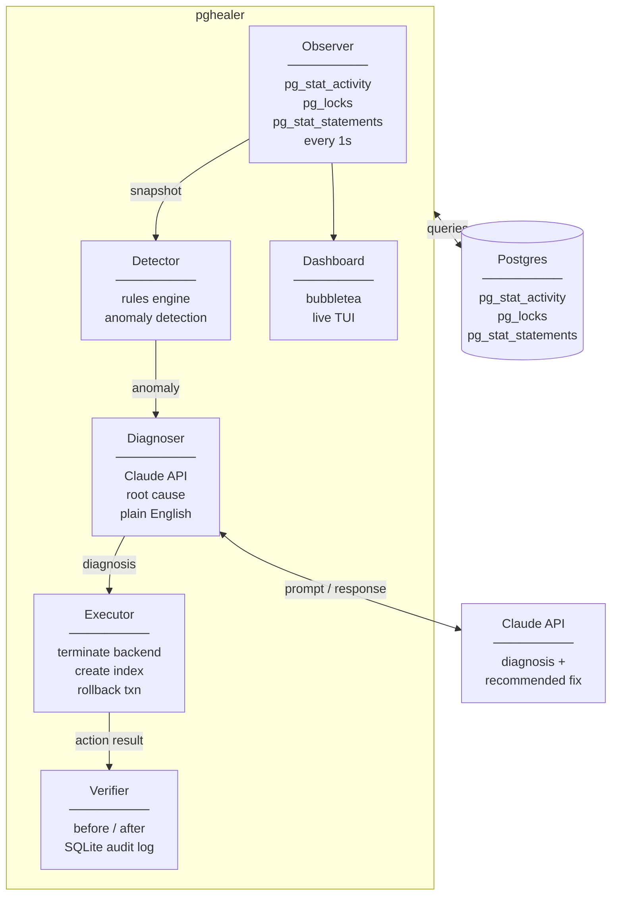

# pghealer

> Autonomous Postgres connection pool agent. Detects, diagnoses, fixes, and verifies pool problems — without waking you up.

---

## The problem

Your Go service slows down at peak traffic. Connections are being held, queued, or timed out. You check your app — looks fine. You check Postgres — hard to tell. By the time you find the culprit it's 2am, you've been manually running `psql` queries for 40 minutes, and users have already noticed.

Every existing tool stops at visibility:

- `pg_activity` — shows you what's wrong. You still fix it manually.
- Datadog — pages you at 2am. You still fix it manually.
- `pgBadger` — analyzes logs after the fact. Too late.

**None of them fix it. pghealer closes the loop.**

---

## The solution

pghealer runs a continuous agent loop against your Postgres instance:

```
Observe → Detect → Diagnose → Fix → Verify
```

**Observe** — polls `pg_stat_activity`, `pg_stat_statements`, and `pg_locks` every second.

**Detect** — rules engine flags anomalies: idle-in-transaction connections, pool exhaustion, slow queries, lock chains.

**Diagnose** — sends anomaly context to AI, gets plain English root cause back. Not just "seq scan detected" — "missing index on `orders.user_id`, scanning 2.1M rows on every checkout request."

**Fix** — applies the right action automatically: `pg_terminate_backend`, `CREATE INDEX CONCURRENTLY`, transaction rollback.

**Verify** — re-checks pool state after every action. Confirms the fix worked. Rolls back if it made things worse.

Everything is visible in a live terminal dashboard. Every action is logged with full before/after state.

---

## Architecture



---

## What it detects and fixes

| Anomaly | Detection | Fix |
|---|---|---|
| Idle-in-transaction | `state = idle in transaction` > threshold | `pg_terminate_backend(pid)` |
| Pool exhaustion | wait queue > N + active > 90% max | Alert + pgBouncer recommendation |
| Slow query | query duration > threshold | Kill or alert |
| Missing index | seq scan on large table via EXPLAIN | `CREATE INDEX CONCURRENTLY` |
| Lock chain | blocking PID chain via `pg_locks` | Terminate root blocker |
| Uncommitted transaction | open txn > N minutes | Rollback with warning |

---

## Safety

**`--safe` (default)** — detects and diagnoses everything. Shows exactly what it plans to do and waits for your keypress before acting.

**`--auto`** — fully autonomous. Acts immediately. Every action logged with full before/after state.

Destructive actions like dropping indexes are never taken automatically — only suggested.

---

*Installation, configuration, and CLI reference coming soon.*
